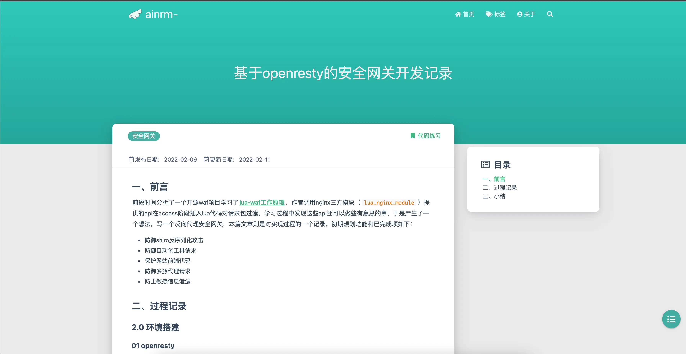

### 0x01 简介

这是一个基于openresty的安全网关，使用提供的指令和接口将lua代码插入至nginx处理http请求的不同阶段来实现包过滤效果，相较于传统waf该网关侧重于业务方面的防护，特点之一是具备防自动化工具请求能力，但目前还只是一个demo项目，具体的开发过程记录在[这里](https://ainrm.cn/2022/safegate.html)，后续可能会增加如文中所规划的功能



### 0x02 文件说明

核心文件是`init.lua`，包含了具体的处理逻辑，`config.lua`为配置文件，决定是否启用某些功能，然后在nginx中配置`access_by_lua_file`、`header_filter_by_lua_file`、`body_filter_by_lua_file`来调用具体函数

```bash
.
├── 403.lua  # 403页面
├── aes.lua  # aes加解密
├── b64.lua  # base64转码
├── config.lua  # 配置文件
├── fileio.lua  # 文件io相关
├── init.lua  # 处理请求的具体逻辑
├── log.lua  # 日志相关
├── log  # 保存日志的路径
│   ├── error.log
│   └── localhost_2022-02-11_sec.log
├── nginx
│   ├── nginx.conf  # 示例配置
│   └── zE48AHvK  # 下发cookie相关文件
│       ├── crypto-js.min.js
│       ├── index.html
│       ├── info.html
│       ├── info.js
│       ├── jump.js
│       └── webdriver.js
├── node  # babel混淆规则
│   └── js_confuse.js
├── randomStr.lua  # 产生随机字符串
├── req.lua  # 处理发来的请求，由access_by_lua_file调用
├── resty -> /usr/local/openresty/lualib/resty  # 软链接过来的库文件
├── rsp_body.lua  # 处理返回包体内容，由body_filter_by_lua_file调用
├── rsp_header.lua  # 处理返回包头内容，header_filter_by_lua_file调用
├── tableXstring.lua  # table与string转换
└── whiteList.lua  # 白名单相关
```

### 0x03 使用说明

首先在http块中引入lua文件：

- lua_package_path
- lua_shared_dict
- init_by_lua_file

然后在server块中引用具体lua文件：

- access_by_lua_file
- header_filter_by_lua_block
- body_filter_by_lua_file

示例：

```lua
http {
    lua_package_path "/gate/?.lua";
    lua_shared_dict limit 10m;
    init_by_lua_file  /gate/init.lua;

    server {
        location /test {
            access_by_lua_file /gate/req.lua;
            proxy_pass http://127.0.0.1:8000/req;
            proxy_connect_timeout 2s;
            header_filter_by_lua_file /gate/rsp_header.lua;
            body_filter_by_lua_file /gate/rsp_body.lua;
        }
    }
}
```

